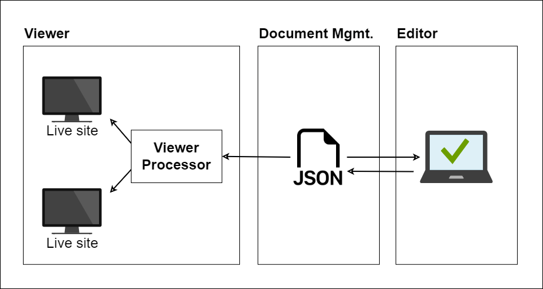
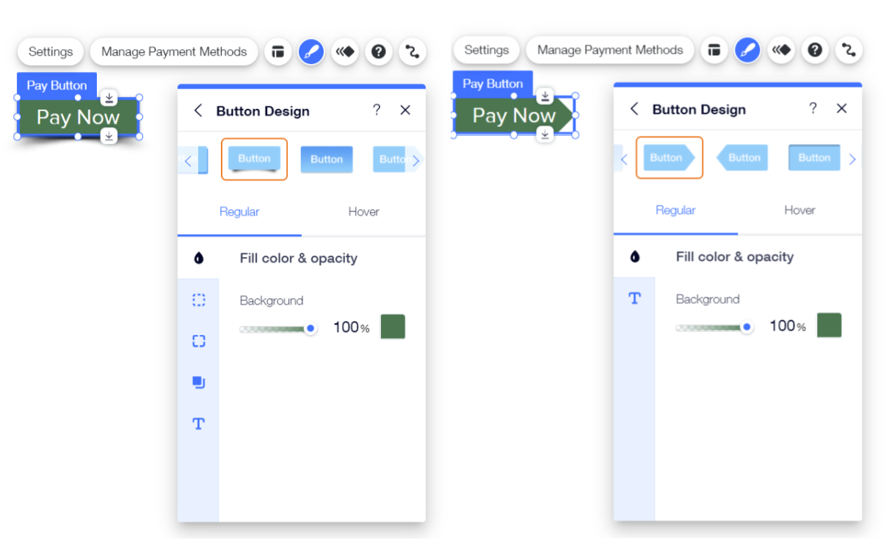
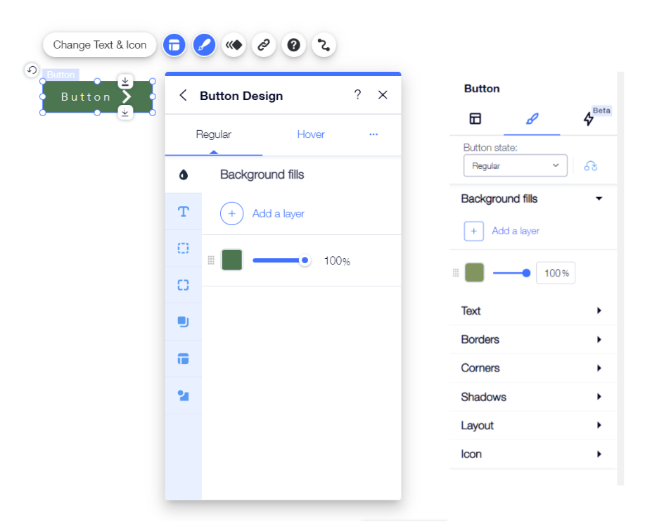

# Case Study: How We Integrated Stylable in Wix

Migration of code from one platform to another is an immensely complex process, it requires both tight coordination between teams, and a large amount of work. As such, it usually requires an equally immense justification. This is the story of Stylable, and how Wix justified the migration to it, and then carried it out. 

In order to understand why Stylable is such a good fit for Wix, we need to start from the beginning. 

## A Brief History of Styling in Wix Editors

When we started discussions about migrating to Stylable, most user components (the components you can drag & drop to your website) in the Wix Editors were styled using an architecture that involved runtime JS variables being translated to CSS. The methodology had several moving parts outlined below.

### Inner Workings of the Wix Editors

Firt, let's talk about how the Wix Editors work. For the sake of this review, we are treating the Wix Classic Editor and EditorX as the same. There are major differences between the two, but at basic architecture level they are identical.

When editing in the Wix Editors, the user does not directly edit the HTML, CSS and JS of the website. Instead, they edit a JSON file that contains two sets of instructions:

1. instructions for rendering the website in a minimal "live" state - the minimal HTML, CSS and JS required for rendering the site in the browser

2. additional instructions for rendering the website in editor mode - metadata that assists the editing process by giving The Editor instructions regarding editing panels, optional features, etc.

This JSON file is stored and made available by a service called Document Management. In the Preview and Live Site  the site is rendered by a service called The Viewer which uses the first set of instructions for creating the minimal rendered content. In the Editor it is rendered via both sets of instructions, allowing all the advanced editing capabilities. The Editor also writes to this same JSON.

> Above is a ***very*** rough diagram of the Wix Editor architecture

### Predefined Design Variables

Prior to Stylable, each component had a set of predefined JS variables like `componentBgColor` and `componentBorderWidth` and these could be edited by users (in our example, using a color picker, or a slider respectively). This gave users some control of their designs, but it was limited to supporting only variables that were defined in the component development process. 

There’s a philosophical product decision here; there’s inherent tension between the desire to give users full creative freedom vs. the desire to provide a guard-rail against making mistakes. When making products for someone with zero experience, you add a lot of guard-rails; when making products for experts, you strive for full creative freedom. 

This styling methodology gave our Product Managers and Developers the tools they needed to make the components easily editable for users with zero experience. But, as our desire to provide more creative freedom to our advanced users grew, it became more and more a hindrance to moving forward. 

In addition, there was growing market pressure to expose textual CSS editing throughout Wix. Competition was allowing it, and we couldn’t. Furthermore, the gap from allowing it felt like it was growing wider with each new variable we introduce. How were users supposed to know what these variables were and how to utilize them properly? 

### Component Skins 

Each component was also matched with a map between its variables and the actual CSS template code (we call these maps “skins”, and a component could potentially be compatible with several such skins). 

While this allowed us to expand the creative freedom by creating more and more skins that match user-requested designs.It also meant that a component did not have a predictable set of editable values. 

A user could drag two differently designed buttons onto the stage, and wish to give them similar shading, only to discover that in one of them the shadows were accessible for design while on the other they were not.
This too proved to be an ever-widening gap. The more design options we offer, the more complex our system becomes. 

> In this image we can see the different design options offered per skin in the original system.

### Runtime processing

Another mechanism we had in place was the translation in runtime between JS variables and the CSS they were referencing. The variables would be processed in JS and then translated to CSS in runtime, as the site was rendering - both in editor and live-site modes. 

In a company-wide effort Wix made great strides in making this flow become a lot more performant - moving the variables to CSS custom-properties and stopping almost all runtime JS in the loading of a live site (CSS custom-properties were not fully supported in IE11, and so they were not part of the original solution. In fact, the original system had been designed to support IE6 because at the time it was still in use).  

However, the number of variables we were saving was growing at a staggering pace. More and more advanced use-cases came up, and the method we were using was inflating the code; it feels like we were assigning a variable for pretty much every declaration of every rule, for every single component. 

> This problem is not unique to Wix. The [CSS Shadow Parts spec](https://www.w3.org/TR/css-shadow-parts-1/#motivation) makes a very similar point, when outlining its motivations.

> "... If a component wishes to allow arbitrary styling of something in its shadow tree, the only way to do so is to define hundreds of custom properties (one per CSS property they wish to allow control of), which is obviously ridiculous for both usability and performance reasons. The situation is compounded if authors wish to style the component differently based on pseudo-classes like `:hover`; the component needs to duplicate the custom properties used for each pseudo-class (and each combination, like `:hover:focus`, resulting in a combinatorial explosion). This makes the usability and performance problems even worse ..."

### Backoffice Applications 

Lastly, and tangentially related, Wix also produces multiple backoffice screens for its users as well as a multitude of editing panels. These help our users manage things from payments and permissions, to restaurant menus and course availability calendars, and to editing in multiple editors and flows. All of these are also made using a component infrastructure, but here the needs are  different. 

While the components that make up these products are not editable by users, they do need to support multiple themes (for different editors and user contexts), and a wide gammut of flows desigend by different teams with sparse connections between them.

The styling options available for developers creating these component was suffering from a large variance, and each team worked using its own methodology. Cooperation, collaboration, and the ability to re-use components that others worked on were all impeded. There was a need to minimize this variance, while still providing all the tools needed to maintain and enrich the component libraries in use.

## Stylable comes into play

We needed to rethink our path. 

Stylable was developed inside Wix, aimed at solving the multitude of  problems that arise in our ecosystem. As such, it was a very promising solution to our biggest concerns. (My friends and colleagues Nadav and Ido wrote a [blog post](XXXXX) on this subject if you're interested in further reading - A.K.)

1. Stylable lets us expand the creative freedom of users to do whatever they want. If each element in each component’s structure was now exposed to us via API, we could let users contextually reach any element in the component and change its CSS directly (with or without a visual controller). On the one hand, very powerful, and on the other, very safe. 

2. Stylable makes our components’ API more predictable, so we can lose the ‘skins’ mechanism and all of the bespoke mapping we do per component. The component "map" is written in its Stylable stylesheet (using pseudo-elements and pseudo-states), simplifying our code and its structure. 

3. Stylable works hard at build-time, but has almost no runtime processing costs. Wix’s flow has a similar use-case - an editor that can take long to process vs. a live site that needs to take milliseconds to render if you want people to use it. So we could let users in editor-mode edit the Stylable file with all the information and metadata we included in it; and, at the same time Stylable’s output is pure CSS, so we can count on it to perform as well if not better than any solution we have in place. 

4. Stylable provides excellent tooling for working with component libraries. From code completions and "type-safety", to mixins and formatters, Stylable allows component developers and UI implementers an excellent framework for theming their components for the right context (Classic Editor vs EditorX, for example), while giving them the expressive freedom needed to create any interface.

We reviewed several other solutions available in the market, but none of them checked off all the boxes. Stylable was the only solution that was fully suitable for our needs, and the group that worked on it was fully committed to our success. 

## The plan

It was worth a proof-of-concept if nothing more. We needed a plan, and it needed to be feasible within 2-3 years and with limited resources. And in Wix, when you’re not sure how to approach a new problem, you start with an Editor Panel, so that's what we did. 

This panel had three main goals:

1. it would work in **ALL the Editors** (current & future)

2. it would edit **ALL the components**

3. it would give access to **ALL the CSS** we could safely allow

This guy quickly became a mainstay in our roadmap presentations: 

And so we formulated a plan. We would add a `component.st.css` to each component which contains its styling API as well as its actual styles, and create a panel that knows how to edit Stylable files directly.

The panel needed to know how to read and write Stylable CSS, so that it can reflect the selector context of each rule correctly. And, it needs to then know how to read and write the CSS declarations contained within each rule, so it can allow viewing their current values and editing them.  

We started a proof-of-concept, creating a panel that knows how to edit Stylable files outside the editor context. It took 2 different attempts at a passable UI/UX flow, but the second one it was a hit. 

> The new panel at it manifests today in the Wix Classic Editor and EditorX.

So we formed an integration and migration plan: 

1. We needed to integrate Stylable in the right places so that The Viewer would run pure CSS, while The Editor would load and generate Stylable source code 

2. We needed to make sure our panel loads with the right Stylable CSS, and know how to edit this code in real-time 

3. We needed to start making our components compatible with the new infrastructure - this was also an opportunity to re-evaluate some of our components and add the most requested features to them. So at least some of them would be rewritten 

One by one, each of the editor components would be replaced with Stylable counter-parts. 

And as complicated as this was, it would be worth it if it solved our largest concerns. 

## So where are we today? 

That was about four years ago. After a few large struggles and many small victories, we're at a good point to evaluate how we did.

First of all, we’ve proven beyond reasonable doubt that Stylable solves our main concerns and that it is the correct way forward. Let’s re-evaluate the driving concerns and how working with Stylable manages to give us an answer to the most pressing ones.

1. The design freedom we can give users has increased substantially - we even have working POCs that allow users to edit Stylable CSS textually. The only hurdle remaining is reaching a critical mass in the migration process. 

2. Skins are no longer part of our architecture. All new and migrated components no longer require skins, and this saves much unnecessary complexity. 

3. The performance of Stylable-based components both in the Editor and live sites is at least on par with existing components, and in some cases a marked improvement. 

Secondly, we finished the integration process, including handing off every part of the integration to the relevant infrastructure teams (so if we changed the way The Viewer processes component files to support Stylable, the owners of this code are now Viewer Infrastructure engineers). 

And last, we’ve given the reins to the component creation groups. Stylable is now an organic part of our component ecosystem, there's no need to do anything special in order to use it, just follow the natural flow. That's a good sign the migration has concluded successfully.
